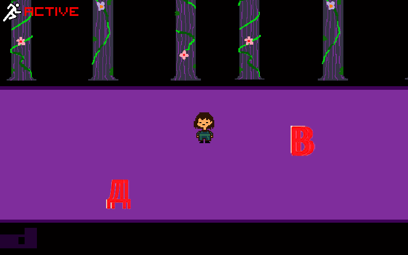
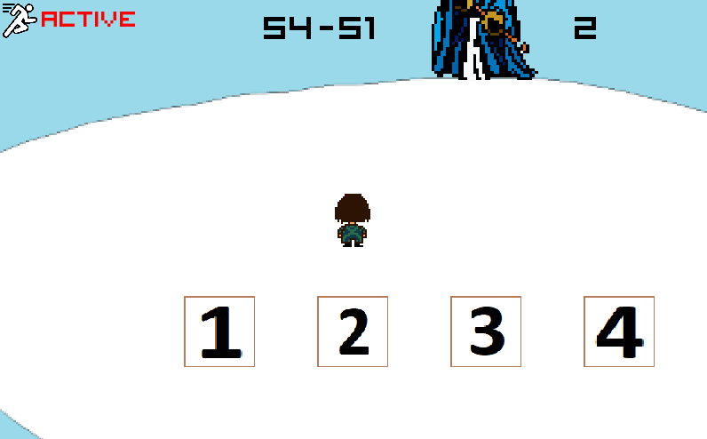
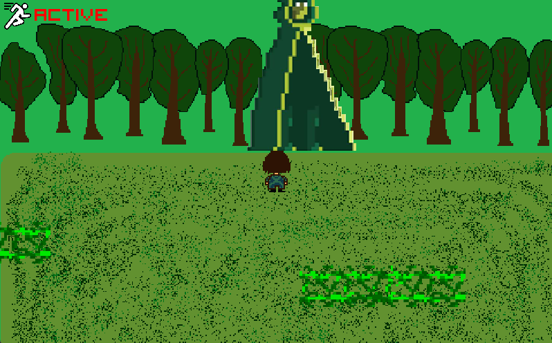

# Entangled Tale

## О чем

	Entangled Tale - это увлекательная игра про человека, который загадочным образом попал в подземный мир с монстрами, который раньше жили в мире с людьми, но за годы они начали враждовать и забыли те былые времена новой ненавистью. Эта ситуация разделила монстров на 2 лагеря: одни люто ненавидели любое проявление человека, а другие верили в возможность примирения и освобождения из подземелья. Эта игра сделана в 8-битной стилистике. Она реализована на Python с использованием библиотеки pygame. 

## Реализация

	При загрузке открывается начальный экран, реализация через функцию start_screen. Затем открывается окно с разъяснением об игровом управлении. 
	В классе «Player» создаётся игрок, именно им мы управляем. Он находитсся всегда в центре экрана, наблючение за которым организовано через класс «Camera». Игрок двигается по карте, которая реализована через класс «Background».
	Класс «Door» реализовывает двери, благодаря которым, мы можем менять локацию. Они могут различаться в отличии от локации. 
	В игре также есть локации с боссами, атаки которых реализованы с помощью классов «Rectangle», «Button», «Platform»
	Классы «Button», «Chest», «Pass», «Button», «WizardRus», «Traveler», «Apple», «Defens» обеспечивают сюжетную игру на локациях до боссов.
	Функция «menu» останавливает игру и дает возможность выбрать один из актов или таблицу результатов.
	При проигрыше на любом из актов выйдет окно с информацией о поражении и времени нахождения на нем. При победе выйдет окно с информацией о победе и времени нахождении на нем. Реализация этого окна производится функцией «end_screen».  После победы на 3 акте показываются субтитры, реализованные во функции «sybtit_screen». Также при победе результаты об игре записываются в общую статистику с помощью функции «results».

## Технологии и библиотеки

```
• Pygame
• random
• sys
• sqlite3
• os
• datetime
```

## Кадры игры




